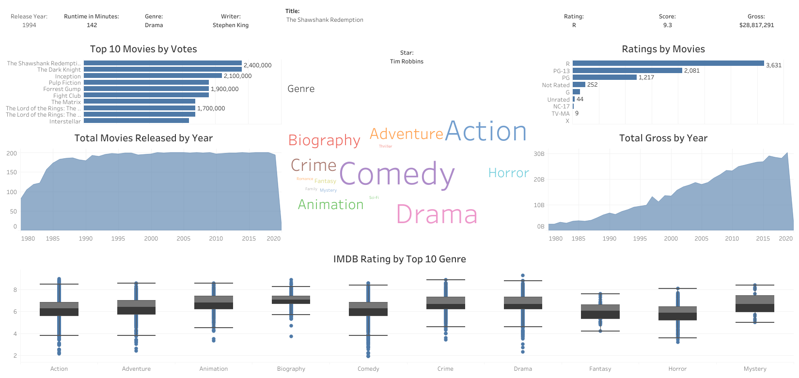

# IMDB Data Visualization
## Purpose
I have a passion for data and movies, this visualization tackles IMDB top movies and aims to show trends of the data.

The link to the data visualization dashboard can be found here: [Tableau Dashboard](https://public.tableau.com/app/profile/noah.renella/viz/IMDB-data-visualization/Dashboard1)

## Tools
I used Python, Tableau, Excel, and Kaggle for this project.

Python was used for data cleaning and formating.

The Movie Data can be found here: [Kaggle](https://www.kaggle.com/datasets/danielgrijalvas/movies)

Tableau was used for visualizing the data as seen above

## Extra Notes

Thank you checking it out.

Send me any suggestions at: NTRenella@gmail.com

